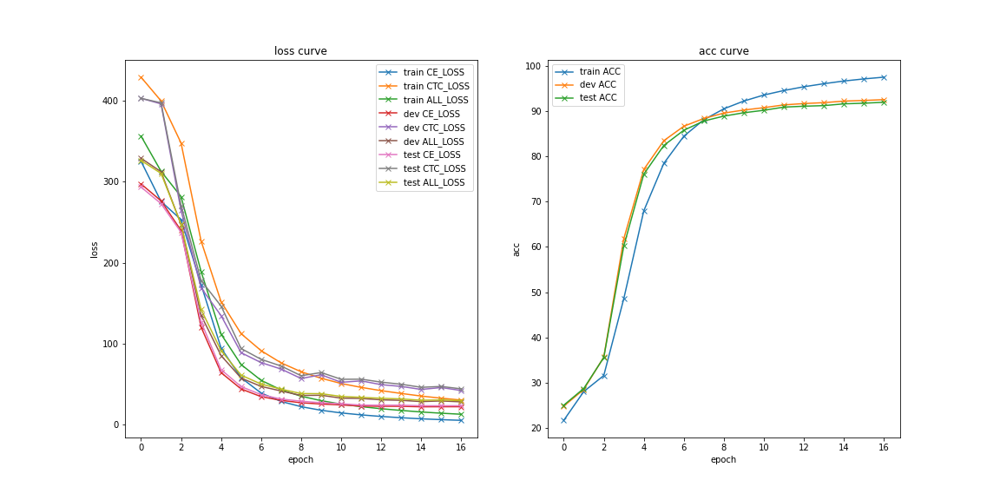
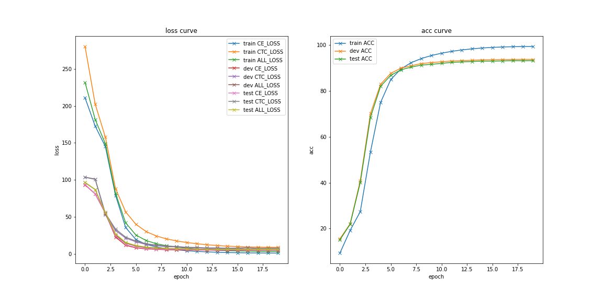
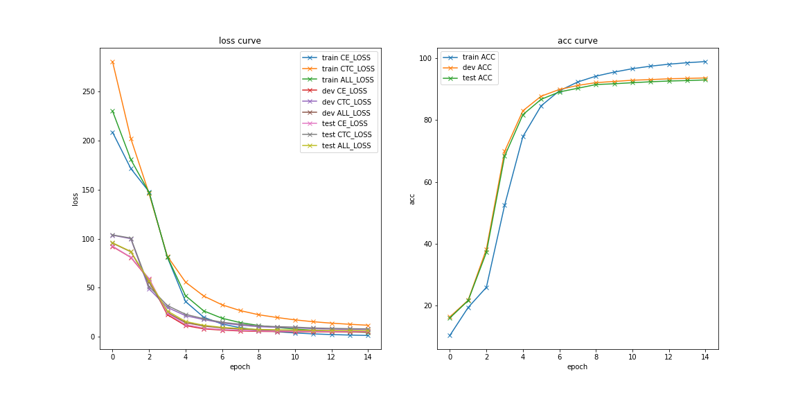

# End-to-End-ASR

A pytorch implement of End-to-End ASR 

- Transformer Based Encoder and Decoder
- Transformer Based Encoder and Decoder ([ESPNET](https://github.com/espnet/espnet) style)
- [Self-and-Mixed Attention Decoder with Deep Acoustic Structure for Transformer-based LVCSR](https://arxiv.org/abs/2006.10407)

# Model Architecture

... ...

# Result

E2E Model|WER
|---|---|
E2E Vanilla Transformer (w/o LM)|12.29
E2E ESPNET Transformer (w/o LM)|11.54
Self and Mixed (w/o LM)|9.26

# Training Curve

### E2E Vanilla Transformer

### E2E ESPNET Transformer

### Self and Mixed

